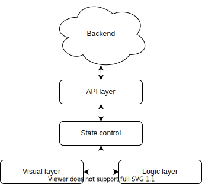
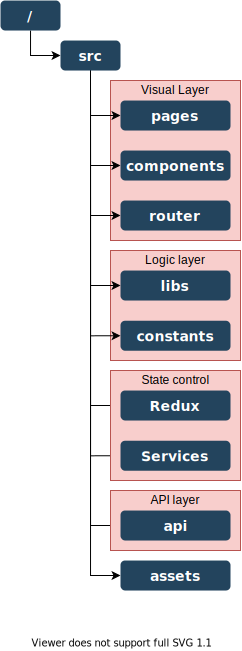
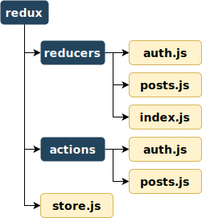
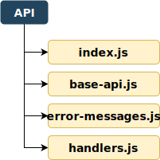
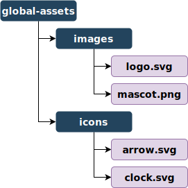

# Architecture

A live version of this document can be found [here](https://architecture-specification.netlify.com/), and it's github repository can be found [here](https://github.com/Jeansidharta/architecture)

This document's purpose is to specify the architecture of [this](https://xd.adobe.com/view/e5a9d78f-bae8-4fe1-43ce-4ab2e2c67ea0-9398/?fullscreen) web application, using React and Redux. The architecture should have the following specifications:
- **Separation of modules:** What criteria should be used to group modules by.
- **Module comunication:** To whom should modules comunicate with and how should this comunication happen.
- **Folder structure:** How should the project's modules be organized, and where should new modules be placed.

Note: a module is simply a javascript file that exports code.

## Layers
In a macroscopic view, the project is composed by layers that comunicate with each other. Layers are a group of modules, held together by their core purpose, and each Layers should have a very broad but distinguishable purpose.

The project will be separated by four layers: **API layer**, **State control layer**, **Visual layer** and **Logic layer**. Their relationships are represented below:

### 1 - Visual layer
Responsible for the interface itself, displaying data and handling user input. It's modules will mainly contain styling and DOM related code, alongside raw event-handling and data displaying. This layer will, by far, contain the largest amount of code.

### 2 - Logic layer
Responsible for holding application-wide logic and values. If some algorithm is used in many pages/components, it should be grouped into a module and placed into the logic layer. Some examples are: data transformation (celcius -> fahrenheit), authentication assertion (make sure user is logged in), state-dependent rendering (only render components if some state is available).

### 3 - State control layer
Responsible for storing and managing application state. It's modules will be constituted by Redux actions, Redux reducers and cache-related logic. It should also be responsible for managing the browser's local storage and for making sure all states are being properly updated

### 4 - API layer
Responsible for communicating with the backend. Some of it's duties are managing authorization tokens, making sure the correct headers are being sent, reporting to the Visual layer the correct error message for any failed request, etc...

### Layer comunication

Layer comunication should be somewhat rigid and have a specific purpose. This will be described below:
- **API layer:** The API layer is the only one allowed to maked HTTP requests, and therefore the only one capable of communicating with the backend. It should only export functions as request wrappers, such as `function fetchUser(userId: number) : APIResponse<User>`. This layer will only export it's wrappers to the _State control layer_ to allow for data cache control and to make sure all necessary components are updated when new data arrives.
- **State control layer:** This layer will receive api handlers from the _API layer_ and export functions for reading and writing state values to the _Visual layer_. If needed, this layer will use logic from the _Logic layer_.
- **Visual layer:** This layer should not export resources to other layers. It will import state-manipulation functions from the _State control layer_ and logic-related functions from the _Logic layer_. It will use these functions for displaying and updating data according to user behavior.
- **Logic layer:** This should not import resources from other layers. It should export self-contained logic in the form of modules. These modules could be used by both _Visual layer_ and _State control layer_.

## Folder structure

now that we have a very solid understanding of the layer structure, it's time we move to a more code-related subject: folder structure. The proposed model is ilustrated by the image below:

Note that all folders (except `/src/assets`) belong to a layer. That means the contents of the folders should fit their respective layer's definition and purpose.

Each folder will be throughoutly explained in the next sessions.

### Root folder - `/`

Holds configuration-related files, such as `package.json`, `.babelrc` or `tsconfig.json`. Should also hold any auto-generated files or folders, such as `build/`, `out/` or `node_modules/`.

### `/src`

Contains the all user-written code and assets. Besides the 9 other folders already shown in the previous image, this folder should have a single `index.js` file that bootstraps the whole project.

### `/src/pages`

Has all page-rendering visual code. It should contain a single folder for each page in the application. This folder must have an `index.js` file that exports the page component, and could contain other files that only provide code specific to that page (such as a component or an image). A possible example is ilustrated by the following image:

<image src='./pages-example.svg'>

### `/src/components`

Any component that is used in multiple points of the application should be placed here. This folder's structure is identical to `/src/pages`, but it's folders represent components, not pages.

<image src='./components-example.svg'>

### `/src/router`

This folder should have all routing-related code. It must have at least two files: `router.js`, which is responsible for showing the correct page at the correct browser path, and `paths.js`, which exports all of the application's path strings.

### `/src/libs`

Contains all code related to the _Logic layer_. It could contain `.js` files in any desired folder structure.

### `/src/constants`

Should hold any constant values that are used application-wide and, if necessary, must be easily changeable. This folder could contain any `.js` files in any folder structure, but files should only have the minimum amount of logic to generate their respective constant values. Some examples of possible files are: `colors.js` that exports the application's used colors, `env` that exports a boolean indicating whether this is a production or development build, etc...

### `/src/redux`

Contains all redux-related code. Should have a `store.js` file that exports the redux store, a `reducers` folder that contains all reducers and an `actions` folder that contains all action creators.

The `reducers` folder should contain multiple modules, each exporting a reducer related to a part of the global state. it should also have an `index.js` file that imports all reducers, combines them and exports that combination.

The `actions` folder is very similar to the `reducers` folder, but it exports action creators, and should not have an `index.js`.

Here's an ilustration:

### `/src/services`

This folder has any self-contained code whose only purpose is to maintain application state. Some examples of services are: `screen-listener.js` whose job is to update the application state with the current screen size, `user-fetcher` whose job is to update the user's information every few minutes, etc...

This folder can hold both `.js` files and folders, organized at the programmer's leisure.

### `/src/api`
This folder should hold all _API layer_ related code. It should export all request handlers through `index.js`. The folder can contain other `.js` files or folders, but they must only be API related, and cannot export anything to files outsize `/src/api`. Here's an example:

### `/src/assets`

This folder simply holds all assets that are used through the whole application. Since it does not hold any code or programming logic, it's organization dont have to be very rigid, and could be modified if the programmer sees fit. A possible structure sugestion would be this:

